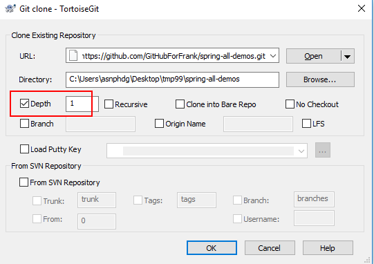

# Spring-All-Demos

                

本项目仓库提供Spring框架的的常用整合用例，包括单框架的使用，各个模块无依赖，均可单独运行。

**版本说明**：

spring： 5.2.2.RELEASE

spring-boot：2.2.2.RELEASE

spring-cloud：Finchley.SR2
 

## 1. Spring Demos

所有 spring 的项目主要提供基于注解的演示。

| Demo Name                                                     | 描述                                                         | 官方文档                                                     |
| ------------------------------------------------------------ | ------------------------------------------------------------ | ------------------------------------------------------------ |
| [springmvc](https://github.com/GitHubForFrank/spring-all-demos/tree/master/spring/springmvc) | springmvc 基础、参数绑定、格式转换、数据校验、异常处理、 文件上传下载、视图渲染 | [Spring Mvc ](https://docs.spring.io/spring/docs/5.2.2.RELEASE/spring-framework-reference/web.html#mvc) |

 

## 2. Spring-boot Demos

| Demo Name                                                      | 描述                                       | 官方文档                                                     |
| ------------------------------------------------------------ | ------------------------------------------ | ------------------------------------------------------------ |
| [spring-boot-actuator](https://github.com/GitHubForFrank/spring-all-demos/tree/master/spring-boot/spring-boot-actuator) | actuator + Hyperic SIGAR 应用信息监控| [Spring Boot Actuator](https://docs.spring.io/spring-boot/docs/2.2.2.RELEASE/reference/htmlsingle/#production-ready) |
| [spring-boot-base](https://github.com/GitHubForFrank/spring-all-demos/tree/master/spring-boot/spring-boot-base) | spring-boot 基础| [spring boot 官方文档](https://docs.spring.io/spring-boot/docs/2.2.2.RELEASE/reference/htmlsingle/) [spring boot 中文官方文档](https://www.breakyizhan.com/springboot/3028.html) |
| [spring-boot-data-jpa](https://github.com/GitHubForFrank/spring-all-demos/tree/master/spring-boot/spring-boot-data-jpa) | spring-boot data jpa 的使用| [Spring Data JPA](https://docs.spring.io/spring-data/jpa/docs/2.1.3.RELEASE/reference/html/) |
| [spring-boot-dubbo](https://github.com/GitHubForFrank/spring-all-demos/tree/master/spring-boot/spring-boot-dubbo) | spring-boot 整合 dubbo| [Dubbo ](http://dubbo.apache.org/zh-cn/docs/user/quick-start.html) |
| [spring-boot-jsp](https://github.com/GitHubForFrank/spring-all-demos/tree/master/spring-boot/spring-boot-jsp) | spring-boot 整合 jsp（内置容器）| [JSP Limitations](https://docs.spring.io/spring-boot/docs/2.2.2.RELEASE/reference/htmlsingle/#boot-features-jsp-limitations) |
| [spring-boot-kafka](https://github.com/GitHubForFrank/spring-all-demos/tree/master/spring-boot/spring-boot-kafka) | spring-boot 整合 kafka| [Apache Kafka Support](https://docs.spring.io/spring-boot/docs/2.2.2.RELEASE/reference/htmlsingle/#boot-features-kafka) |
| [spring-boot-logback](https://github.com/GitHubForFrank/spring-all-demos/tree/master/spring-boot/spring-boot-logback) | spring-boot & mybatis 实现动态数据源。不支持分布式事务。 | [Spring XXX ](https://docs.spring.io/spring/docs/5.2.2.RELEASE) |
| [spring-boot-memcached](https://github.com/GitHubForFrank/spring-all-demos/tree/master/spring-boot/spring-boot-memcached) | spring-boot 整合 memcached| [Xmemcached](https://github.com/killme2008/xmemcached/wiki/Xmemcached%20%E4%B8%AD%E6%96%87%E7%94%A8%E6%88%B7%E6%8C%87%E5%8D%97) |
| [spring-boot-mybatis-druid](https://github.com/GitHubForFrank/spring-all-demos/tree/master/spring-boot/spring-boot-mybatis-druid) | spring-boot & mybatis & druid 单数据源。| [Spring XXX ](https://docs.spring.io/spring/docs/5.2.2.RELEASE) |
| [spring-boot-mybatis-druid-atomikos](https://github.com/GitHubForFrank/spring-all-demos/tree/master/spring-boot/spring-boot-mybatis-druid-atomikos) | spring-boot & mybatis 实现动态数据源。不支持分布式事务。 | [Spring XXX ](https://docs.spring.io/spring/docs/5.2.2.RELEASE) |
| [spring-boot-mybatis-druid-dynamic-datasource](https://github.com/GitHubForFrank/spring-all-demos/tree/master/spring-boot/spring-boot-mybatis-druid-dynamic-datasource) | spring-boot & mybatis & druid 实现动态数据源。不支持分布式事务。 | [Spring XXX ](https://docs.spring.io/spring/docs/5.2.2.RELEASE) |
| [spring-boot-mybatis-druid-multiple-datasource](https://github.com/GitHubForFrank/spring-all-demos/tree/master/spring-boot/spring-boot-mybatis-druid-multiple-datasource) | spring-boot & mybatis & druid 实现多数据源。不支持分布式事务。 | [Spring XXX ](https://docs.spring.io/spring/docs/5.2.2.RELEASE) |
| [spring-boot-mybatis-dynamic-datasource](https://github.com/GitHubForFrank/spring-all-demos/tree/master/spring-boot/spring-boot-mybatis-dynamic-datasource) | spring-boot & mybatis 实现动态数据源。不支持分布式事务。 | [Spring XXX ](https://docs.spring.io/spring/docs/5.2.2.RELEASE) |
| [spring-boot-rabbitmq](https://github.com/GitHubForFrank/spring-all-demos/tree/master/spring-boot/spring-boot-rabbitmq) | spring-boot 整合 rabbitmq| [RabbitMQ support](https://docs.spring.io/spring-boot/docs/2.2.2.RELEASE/reference/htmlsingle/#boot-features-rabbitmq) |
| [spring-boot-redis](https://github.com/GitHubForFrank/spring-all-demos/tree/master/spring-boot/spring-boot-redis) | spring-boot 整合 redis | [Working with NoSQL Technologies](https://docs.spring.io/spring-boot/docs/2.1.1.RELEASE/reference/htmlsingle/#boot-features-nosql) |
| [spring-boot-servlet](https://github.com/GitHubForFrank/spring-all-demos/tree/master/spring-boot/spring-boot-servlet) | spring boot 整合 servlet 3.0| [Embedded Servlet Container Support](https://docs.spring.io/spring-boot/docs/2.1.1.RELEASE/reference/htmlsingle/#boot-features-embedded-container) |
| [spring-boot-swagger2](https://github.com/GitHubForFrank/spring-all-demos/tree/master/spring-boot/spring-boot-swagger2) | spring-boot 集成 Swagger2 打造在线接口文档| [Springfox Reference Documentation](http://springfox.github.io/springfox/docs/current/) |
| [spring-boot-tomcat](https://github.com/GitHubForFrank/spring-all-demos/tree/master/spring-boot/spring-boot-tomcat) | spring-boot 整合外部容器（tomcat）| [Use Another Web Server](https://docs.spring.io/spring-boot/docs/2.2.2.RELEASE/reference/htmlsingle/#howto-use-another-web-server) |
| [spring-boot-websocket](https://github.com/GitHubForFrank/spring-all-demos/tree/master/spring-boot/spring-boot-websocket) | spring-boot 整合 websocket| [Using @ServerEndpoint](https://docs.spring.io/spring-boot/docs/2.2.2.RELEASE/reference/htmlsingle/#howto-create-websocket-endpoints-using-serverendpoint) |
| [spring-boot-yml-profile](https://github.com/GitHubForFrank/spring-all-demos/tree/master/spring-boot/spring-boot-yml-profile) | yml 语法和多配置切换| [Springfox Reference Documentation](http://springfox.github.io/springfox/docs/current/) |

 

## 3. Spring-cloud  Demos

| Demo Name                                                      | 描述                                                         | 官方文档                                                     |
| ------------------------------------------------------------ | ------------------------------------------------------------ | ------------------------------------------------------------ |

## Github 常用按钮说明

- Watch：关注该项目，作者有更新的时候，会在你的 Github 主页有通知消息。
- Star：收藏该项目，在你的头像上有一个 “Your stars” 链接，可以看到你的收藏列表，以方便下次进来。
- Fork：复制一份项目到自己的 Github 空间上，你可以自己开发自己的这个地址项目，然后 Pull Request 给项目原主人。 
- 只 clone 最新的一个版本记录，历史旧数据不 clone 的两种方法（推荐这样做，因为图片很多，占了很大空间）：
	- 命令行方法：`git clone https://github.com/GitHubForFrank/spring-all-demos.git --depth=1`
	- TortoiseGit GUI 方法：

